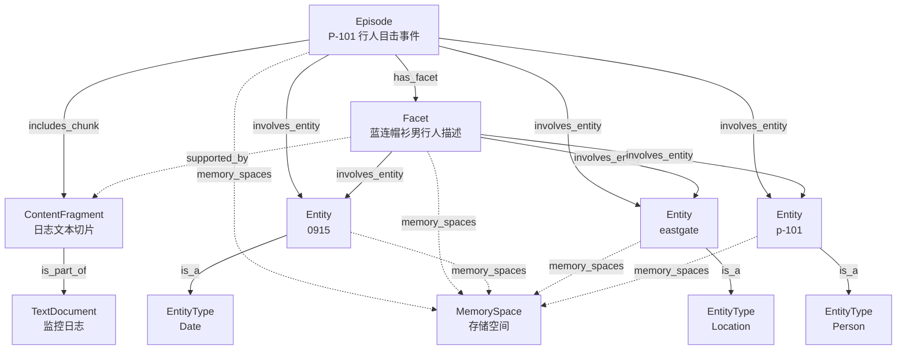

# M-flow 记忆存储结构实例分析

> 本文档基于脚本的实际运行结果，展示一条简单记忆在 M-flow 内部的完整存储结构。

---

## 一、添加的记忆文本

```python
SAMPLE_TEXT = (
    "Time: 09:15 | Location: East Gate | Pedestrian: P-101 | "
    "Features: Male, blue hoodie | Carried item: brown paper bag."
)
```

这是一条监控日志格式的行人观察记录，包含时间、地点、行人标识、外貌特征和携带物品等信息。

---

## 二、图数据库节点分析（共 11 个）

经过 `memorize` 管线处理后，系统将上述文本解析为一张知识图谱，共生成 **11 个节点**，按类型分组如下：

### 1. Episode（事件节点）— 1 个

| 属性 | 值 |
|------|-----|
| **名称** | `Pedestrian P-101 Sighting at East Gate (09:15)` |
| **说明** | 东门 P-101 行人目击事件，是整个记忆网络的入口锚点 |
| **摘要** | 包含对事件的整体描述（被向量索引，用于语义检索） |

### 2. Facet（主题/事实面节点）— 1 个

| 属性 | 值 |
|------|-----|
| **名称** | `Male pedestrian with blue hoodie carrying a brown paper bag...` |
| **说明** | 关于身穿蓝色连帽衫、手提棕色纸袋的男行人的目击主题 |
| **类型** | 描述事件的具体方面（如 observation / description） |

### 3. ContentFragment（文本片段节点）— 1 个

| 属性 | 值 |
|------|-----|
| **内容** | `"Time: 09:15 \| Location: East Gate \| Pedestrian: P-101 \| Features: Male, blue hoodie..."` |
| **说明** | 原始日志文本的切片，作为证据追溯的底层支撑 |

### 4. TextDocument（原始文档节点）— 1 个

| 属性 | 值 |
|------|-----|
| **名称** | `Surveillance Log` |
| **说明** | 监控日志文本文件，代表原始数据来源 |

### 5. Entity（实体节点）— 3 个

| 序号 | 实体名称 | 含义 |
|:----:|----------|------|
| ① | `0915` | 时间点实体（09:15） |
| ② | `eastgate` | 东门地点实体（East Gate） |
| ③ | `p-101` | 行人标识实体（P-101） |

### 6. EntityType（实体类型节点）— 3 个

| 序号 | 类型名称 | 含义 |
|:----:|----------|------|
| ① | `Date` | 日期/时间类型 |
| ② | `Location` | 位置类型 |
| ③ | `Person` | 人物类型 |

### 7. MemorySpace（存储空间节点）— 1 个

| 属性 | 值 |
|------|-----|
| **说明** | 用于归类上述实体的内部存储空间节点，实现子图隔离 |

---

## 三、图数据库边分析（共 18 条）

18 条边按功能可分为以下四类：

### 3.1 层级与支撑关系（4 条）

| 关系类型 | 源节点 → 目标节点 | 含义 |
|----------|-------------------|------|
| `includes_chunk` | **Episode** → **ContentFragment** | 事件包含文本片段 |
| `is_part_of` | **ContentFragment** → **TextDocument** | 文本片段属于原始文档 |
| `has_facet` | **Episode** → **Facet** | 事件关联了特定的主题 |
| `supported_by` | **Facet** → **ContentFragment** | 主题得到文本片段的数据支撑 |

### 3.2 实体关联关系（6 条）

| 关系类型 | 源节点 → 目标节点 | 含义 |
|----------|-------------------|------|
| `involves_entity` | **Episode** → **Entity(`0915`)** | 事件涉及时间实体 |
| `involves_entity` | **Episode** → **Entity(`eastgate`)** | 事件涉及地点实体 |
| `involves_entity` | **Episode** → **Entity(`p-101`)** | 事件涉及行人实体 |
| `involves_entity` | **Facet** → **Entity(`0915`)** | 主题涉及时间实体 |
| `involves_entity` | **Facet** → **Entity(`eastgate`)** | 主题涉及地点实体 |
| `involves_entity` | **Facet** → **Entity(`p-101`)** | 主题涉及行人实体 |

### 3.3 分类与属性关系（3 条）

| 关系类型 | 源节点 → 目标节点 | 含义 |
|----------|-------------------|------|
| `is_a` | **Entity(`0915`)** → **EntityType(`Date`)** | 实体"0915"属于日期/时间类型 |
| `is_a` | **Entity(`eastgate`)** → **EntityType(`Location`)** | 实体"eastgate"属于位置类型 |
| `is_a` | **Entity(`p-101`)** → **EntityType(`Person`)** | 实体"p-101"属于人物类型 |

### 3.4 空间归属关系（5 条）

| 关系类型 | 源节点 → 目标节点 | 含义 |
|----------|-------------------|------|
| `memory_spaces` | **Episode** → **MemorySpace** | 事件映射到存储空间 |
| `memory_spaces` | **Facet** → **MemorySpace** | 主题映射到存储空间 |
| `memory_spaces` | **Entity(`0915`)** → **MemorySpace** | 时间实体映射到存储空间 |
| `memory_spaces` | **Entity(`eastgate`)** → **MemorySpace** | 地点实体映射到存储空间 |
| `memory_spaces` | **Entity(`p-101`)** → **MemorySpace** | 行人实体映射到存储空间 |

---

## 四、完整知识图谱结构图



---

## 五、存储结构总结

| 维度 | 说明 |
|------|------|
| **节点总数** | 11 个（7 种类型） |
| **边总数** | 18 条（6 种关系类型） |
| **核心入口** | `Episode` 节点作为记忆网络的锚点入口 |
| **证据链** | `Episode → ContentFragment → TextDocument` 形成完整的证据追溯链 |
| **实体抽取** | 从文本中自动抽取了 3 个实体（时间、地点、人物），并关联了对应的实体类型 |
| **主题抽象** | `Facet` 节点对事件进行主题层面的抽象描述 |
| **空间隔离** | 所有核心节点通过 `memory_spaces` 边映射到同一个 `MemorySpace`，实现子图隔离 |
| **向量索引** | `Episode.summary`、`Facet.search_text`、`Entity.name` 等字段被向量化，支持语义检索 |

---

## 六、关键设计要点

1. **多级抽象**：从原始文本（`TextDocument`）→ 文本切片（`ContentFragment`）→ 事件（`Episode`）→ 主题（`Facet`），层层抽象，兼顾细节保留和语义理解。
2. **实体归一化**：实体名称被统一转为小写（如 `East Gate` → `eastgate`），便于跨事件匹配和合并。
3. **类型系统**：实体通过 `is_a` 边关联到 `EntityType` 节点，形成分类体系，支持按类型检索。
4. **证据追溯**：`supported_by` 和 `includes_chunk` 关系确保每个抽象结论都可追溯到原始文本，保证可解释性。
5. **空间隔离**：`MemorySpace` 机制支持多租户/多数据集的子图隔离，不同来源的记忆互不干扰。


## 七、原始日志输出
```
 共查询到 11 个节点, 18 条边


==============节点详情==============

  ▶ ContentFragment (共 1 个)
    ────────────────────────────────────────────────────────────
  📌 ID:   29a7c9dc-74eb-5cc2-a99a-6527f6b45f3a
     version: 1
     metadata: {"index_fields": ["text"], "sentence_classifications": [{"sentence_idx": 0, "tex...
     schema_aligned: false
     graph_depth: 0
     memory_spaces: null
     mentioned_time_start_ms: null
     mentioned_time_end_ms: null
     mentioned_time_confidence: null
     mentioned_time_text: null
     text: "Time: 09:15 | Location: East Gate | Pedestrian: P-101 | Features: Male, blue ho...
     chunk_size: 53
     chunk_index: 0
     cut_type: "sentence_end"
     contains: []
     created_at: 1779993097059
     updated_at: 1780021907287


  ▶ Entity (共 3 个)
    ────────────────────────────────────────────────────────────
  📌 ID:   fd4d93f0-e0b4-5e46-9e09-c81ff079b1ec
     version: 1
     metadata: {"index_fields": ["name", "canonical_name"]}
     schema_aligned: false
     graph_depth: 0
     mentioned_time_start_ms: null
     mentioned_time_end_ms: null
     mentioned_time_confidence: null
     mentioned_time_text: null
     description: "Time point; marks the observation time in the surveillance log."
     canonical_name: "0915"
     memory_type: "atomic"
     same_entity_as: null
     merge_count: 0
     display_only: null
     created_at: 1780021902427
     updated_at: 1780021907287

  📌 ID:   016057e2-5bcb-5241-bf70-b52100a3b1d9
     version: 1
     metadata: {"index_fields": ["name", "canonical_name"]}
     schema_aligned: false
     graph_depth: 0
     mentioned_time_start_ms: null
     mentioned_time_end_ms: null
     mentioned_time_confidence: null
     mentioned_time_text: null
     description: "Specific entrance; the location where the pedestrian P-101 was observed."
     canonical_name: "eastgate"
     memory_type: "atomic"
     same_entity_as: null
     merge_count: 0
     display_only: null
     created_at: 1780021902427
     updated_at: 1780021907287

  📌 ID:   6ee79786-7771-5ac8-b83b-bce11a7dcc9f
     version: 1
     metadata: {"index_fields": ["name", "canonical_name"]}
     schema_aligned: false
     graph_depth: 0
     mentioned_time_start_ms: null
     mentioned_time_end_ms: null
     mentioned_time_confidence: null
     mentioned_time_text: null
     description: "Pedestrian identifier; refers to an individual observed at East Gate at 09:15, ...
     canonical_name: "p-101"
     memory_type: "atomic"
     same_entity_as: null
     merge_count: 0
     display_only: null
     created_at: 1780021902427
     updated_at: 1780021907287


  ▶ EntityType (共 3 个)
    ────────────────────────────────────────────────────────────
  📌 ID:   719015e8-af7b-507c-9c28-e8985b1a9be9
     version: 1
     metadata: {"index_fields": ["name"]}
     schema_aligned: false
     graph_depth: 0
     memory_spaces: null
     mentioned_time_start_ms: null
     mentioned_time_end_ms: null
     mentioned_time_confidence: null
     mentioned_time_text: null
     description: "Entity type: Date"
     created_at: 1780021907241
     updated_at: 1780021907287

  📌 ID:   7f808006-8193-58cd-bdc2-bbdb1d74f5a3
     version: 1
     metadata: {"index_fields": ["name"]}
     schema_aligned: false
     graph_depth: 0
     memory_spaces: null
     mentioned_time_start_ms: null
     mentioned_time_end_ms: null
     mentioned_time_confidence: null
     mentioned_time_text: null
     description: "Entity type: Location"
     created_at: 1780021907242
     updated_at: 1780021907287

  📌 ID:   647aec05-4833-52bf-b2c2-cc80e232bc2e
     version: 1
     metadata: {"index_fields": ["name"]}
     schema_aligned: false
     graph_depth: 0
     memory_spaces: null
     mentioned_time_start_ms: null
     mentioned_time_end_ms: null
     mentioned_time_confidence: null
     mentioned_time_text: null
     description: "Entity type: Person"
     created_at: 1780021907242
     updated_at: 1780021907287


  ▶ Episode (共 1 个)
    ────────────────────────────────────────────────────────────
  📌 ID:   de640d14-7028-5b16-9eb3-b0ef2293af55
     version: 1
     metadata: {"index_fields": ["summary"]}
     schema_aligned: false
     graph_depth: 0
     mentioned_time_start_ms: null
     mentioned_time_end_ms: null
     mentioned_time_confidence: null
     mentioned_time_text: null
     summary: "【Pedestrian P-101 Sighting at East Gate (09:15)】Male pedestrian with blue hoodi...
     signature: "[Atomic] Time: 09:15 |…"
     status: "open"
     memory_type: "atomic"
     dataset_id: "2888740a-cd42-5234-8875-417ba75cc502"
     display_only: null
     derived_procedure: null
     size_check_threshold: null
     created_at: 1779993097059
     updated_at: 1780021907287


  ▶ Facet (共 1 个)
    ────────────────────────────────────────────────────────────
  📌 ID:   93218d82-cacf-508c-9de3-f14bb2ab2a92
     version: 1
     metadata: {"index_fields": ["search_text", "anchor_text"]}
     schema_aligned: false
     graph_depth: 0
     mentioned_time_start_ms: null
     mentioned_time_end_ms: null
     mentioned_time_confidence: null
     mentioned_time_text: null
     facet_type: "topic"
     search_text: "Pedestrian P-101 Sighting at East Gate (09:15)"
     aliases: null
     aliases_text: null
     description: "Male pedestrian with blue hoodie carrying a brown paper bag observed at East Ga...
     display_only: null
     dataset_id: "2888740a-cd42-5234-8875-417ba75cc502"
     anchor_text: "Male pedestrian with blue hoodie carrying a brown paper bag observed at East Ga...
     has_point: null
     created_at: 1779993097059
     updated_at: 1780021907287


  ▶ MemorySpace (共 1 个)
    ────────────────────────────────────────────────────────────
  📌 ID:   d50b4de6-36be-5117-9889-e2b891543e16
     version: 1
     metadata: {"type": "MemoryNode", "index_fields": []}
     schema_aligned: false
     graph_depth: 0
     memory_spaces: null
     mentioned_time_start_ms: null
     mentioned_time_end_ms: null
     mentioned_time_confidence: null
     mentioned_time_text: null
     created_at: 1780021897597
     updated_at: 1780021907287


  ▶ TextDocument (共 1 个)
    ────────────────────────────────────────────────────────────
  📌 ID:   d76ac5cf-e4f8-5c0b-ae04-c45a9432cda0
     version: 1
     metadata: {"index_fields": ["name"]}
     schema_aligned: false
     graph_depth: 0
     memory_spaces: null
     mentioned_time_start_ms: null
     mentioned_time_end_ms: null
     mentioned_time_confidence: null
     mentioned_time_text: null
     processed_path: "file:///home/ustc/m_flow/m_flow/.data_storage/105f2659-818c-4e50-884d-a3fcdf3cc...
     external_metadata: "{}"
     mime_type: "text/plain"
     created_at: 1779993097059
     updated_at: 1780021907287


==============边详情==============

  ▶ has_facet (共 1 条)
    ────────────────────────────────────────────────────────────
  🔗 de640d14-7028-5b16-9eb3-b0ef2293af55  --[has_facet]-->  93218d82-cacf-508c-9de3-f14bb2ab2a92
     source_node_id: "de640d14-7028-5b16-9eb3-b0ef2293af55"
     target_node_id: "93218d82-cacf-508c-9de3-f14bb2ab2a92"
     relationship_name: "has_facet"
     updated_at: "2026-05-29 02:31:47"
     relationship_type: "has_facet"
     edge_text: "Pedestrian P-101 Sighting at East Gate (09:15): Male pedestrian with blue hoodi...


  ▶ includes_chunk (共 1 条)
    ────────────────────────────────────────────────────────────
  🔗 de640d14-7028-5b16-9eb3-b0ef2293af55  --[includes_chunk]-->  29a7c9dc-74eb-5cc2-a99a-6527f6b45f3a
     source_node_id: "de640d14-7028-5b16-9eb3-b0ef2293af55"
     target_node_id: "29a7c9dc-74eb-5cc2-a99a-6527f6b45f3a"
     relationship_name: "includes_chunk"
     updated_at: "2026-05-29 02:31:47"
     relationship_type: "includes_chunk"
     edge_text: "chunk#0"


  ▶ involves_entity (共 6 条)
    ────────────────────────────────────────────────────────────
  🔗 de640d14-7028-5b16-9eb3-b0ef2293af55  --[involves_entity]-->  fd4d93f0-e0b4-5e46-9e09-c81ff079b1ec
     source_node_id: "de640d14-7028-5b16-9eb3-b0ef2293af55"
     target_node_id: "fd4d93f0-e0b4-5e46-9e09-c81ff079b1ec"
     relationship_name: "involves_entity"
     updated_at: "2026-05-29 02:31:47"
     relationship_type: "involves_entity"
     edge_text: "09:15 | Time point; marks the observation time in the surveillance log."

  🔗 de640d14-7028-5b16-9eb3-b0ef2293af55  --[involves_entity]-->  016057e2-5bcb-5241-bf70-b52100a3b1d9
     source_node_id: "de640d14-7028-5b16-9eb3-b0ef2293af55"
     target_node_id: "016057e2-5bcb-5241-bf70-b52100a3b1d9"
     relationship_name: "involves_entity"
     updated_at: "2026-05-29 02:31:47"
     relationship_type: "involves_entity"
     edge_text: "East Gate | Specific entrance; the location where the pedestrian P-101 was obse...

  🔗 de640d14-7028-5b16-9eb3-b0ef2293af55  --[involves_entity]-->  6ee79786-7771-5ac8-b83b-bce11a7dcc9f
     source_node_id: "de640d14-7028-5b16-9eb3-b0ef2293af55"
     target_node_id: "6ee79786-7771-5ac8-b83b-bce11a7dcc9f"
     relationship_name: "involves_entity"
     updated_at: "2026-05-29 02:31:47"
     relationship_type: "involves_entity"
     edge_text: "P-101 | Pedestrian identifier; refers to an individual observed at East Gate at...

  🔗 93218d82-cacf-508c-9de3-f14bb2ab2a92  --[involves_entity]-->  016057e2-5bcb-5241-bf70-b52100a3b1d9
     relationship_name: "involves_entity"
     edge_text: "East Gate | Specific entrance; the location where the pedestrian P-101 was obse...

  🔗 93218d82-cacf-508c-9de3-f14bb2ab2a92  --[involves_entity]-->  fd4d93f0-e0b4-5e46-9e09-c81ff079b1ec
     relationship_name: "involves_entity"
     edge_text: "09:15 | Time point; marks the observation time in the surveillance log. (in: Pe...

  🔗 93218d82-cacf-508c-9de3-f14bb2ab2a92  --[involves_entity]-->  6ee79786-7771-5ac8-b83b-bce11a7dcc9f
     relationship_name: "involves_entity"
     edge_text: "P-101 | Pedestrian identifier; refers to an individual observed at East Gate at...


  ▶ is_a (共 3 条)
    ────────────────────────────────────────────────────────────
  🔗 fd4d93f0-e0b4-5e46-9e09-c81ff079b1ec  --[is_a]-->  719015e8-af7b-507c-9c28-e8985b1a9be9
     source_node_id: "fd4d93f0-e0b4-5e46-9e09-c81ff079b1ec"
     target_node_id: "719015e8-af7b-507c-9c28-e8985b1a9be9"
     relationship_name: "is_a"
     updated_at: "2026-05-29 02:31:47"

  🔗 016057e2-5bcb-5241-bf70-b52100a3b1d9  --[is_a]-->  7f808006-8193-58cd-bdc2-bbdb1d74f5a3
     source_node_id: "016057e2-5bcb-5241-bf70-b52100a3b1d9"
     target_node_id: "7f808006-8193-58cd-bdc2-bbdb1d74f5a3"
     relationship_name: "is_a"
     updated_at: "2026-05-29 02:31:47"

  🔗 6ee79786-7771-5ac8-b83b-bce11a7dcc9f  --[is_a]-->  647aec05-4833-52bf-b2c2-cc80e232bc2e
     source_node_id: "6ee79786-7771-5ac8-b83b-bce11a7dcc9f"
     target_node_id: "647aec05-4833-52bf-b2c2-cc80e232bc2e"
     relationship_name: "is_a"
     updated_at: "2026-05-29 02:31:47"


  ▶ is_part_of (共 1 条)
    ────────────────────────────────────────────────────────────
  🔗 29a7c9dc-74eb-5cc2-a99a-6527f6b45f3a  --[is_part_of]-->  d76ac5cf-e4f8-5c0b-ae04-c45a9432cda0
     source_node_id: "29a7c9dc-74eb-5cc2-a99a-6527f6b45f3a"
     target_node_id: "d76ac5cf-e4f8-5c0b-ae04-c45a9432cda0"
     relationship_name: "is_part_of"
     updated_at: "2026-05-29 02:31:47"


  ▶ memory_spaces (共 5 条)
    ────────────────────────────────────────────────────────────
  🔗 de640d14-7028-5b16-9eb3-b0ef2293af55  --[memory_spaces]-->  d50b4de6-36be-5117-9889-e2b891543e16
     source_node_id: "de640d14-7028-5b16-9eb3-b0ef2293af55"
     target_node_id: "d50b4de6-36be-5117-9889-e2b891543e16"
     relationship_name: "memory_spaces"
     updated_at: "2026-05-29 02:31:47"

  🔗 93218d82-cacf-508c-9de3-f14bb2ab2a92  --[memory_spaces]-->  d50b4de6-36be-5117-9889-e2b891543e16
     source_node_id: "93218d82-cacf-508c-9de3-f14bb2ab2a92"
     target_node_id: "d50b4de6-36be-5117-9889-e2b891543e16"
     relationship_name: "memory_spaces"
     updated_at: "2026-05-29 02:31:47"

  🔗 fd4d93f0-e0b4-5e46-9e09-c81ff079b1ec  --[memory_spaces]-->  d50b4de6-36be-5117-9889-e2b891543e16
     source_node_id: "fd4d93f0-e0b4-5e46-9e09-c81ff079b1ec"
     target_node_id: "d50b4de6-36be-5117-9889-e2b891543e16"
     relationship_name: "memory_spaces"
     updated_at: "2026-05-29 02:31:47"

  🔗 016057e2-5bcb-5241-bf70-b52100a3b1d9  --[memory_spaces]-->  d50b4de6-36be-5117-9889-e2b891543e16
     source_node_id: "016057e2-5bcb-5241-bf70-b52100a3b1d9"
     target_node_id: "d50b4de6-36be-5117-9889-e2b891543e16"
     relationship_name: "memory_spaces"
     updated_at: "2026-05-29 02:31:47"

  🔗 6ee79786-7771-5ac8-b83b-bce11a7dcc9f  --[memory_spaces]-->  d50b4de6-36be-5117-9889-e2b891543e16
     source_node_id: "6ee79786-7771-5ac8-b83b-bce11a7dcc9f"
     target_node_id: "d50b4de6-36be-5117-9889-e2b891543e16"
     relationship_name: "memory_spaces"
     updated_at: "2026-05-29 02:31:47"


  ▶ supported_by (共 1 条)
    ────────────────────────────────────────────────────────────
  🔗 93218d82-cacf-508c-9de3-f14bb2ab2a92  --[supported_by]-->  29a7c9dc-74eb-5cc2-a99a-6527f6b45f3a
     source_node_id: "93218d82-cacf-508c-9de3-f14bb2ab2a92"
     target_node_id: "29a7c9dc-74eb-5cc2-a99a-6527f6b45f3a"
     relationship_name: "supported_by"
     updated_at: "2026-05-29 02:31:47"
     relationship_type: "supported_by"
     edge_text: "Pedestrian P-101 Sighting at East Gate (09:15) <- Time: 09:15 | Location: East ...


==============统计信息==============
  num_nodes: 11
  num_edges: 18
  mean_degree: 3.272727272727273
  edge_density: 0.16363636363636364
  num_connected_components: 11
  sizes_of_connected_components: [12, 12, 12, 12, 12, 12, 12, 12, 12, 12, 12]
  num_selfloops: 0
  diameter: -1
  avg_shortest_path_length: -1
  avg_clustering: -1
```